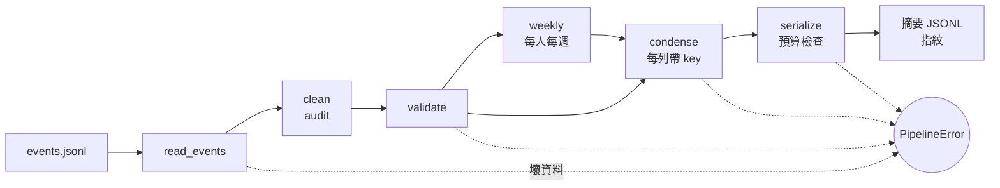

# 18｜從 JSONL 到 LLM 可讀摘要

> **正文初稿：2026-10-05｜對應新版資料處理與分析第 18 節：從 JSONL 到 LLM 可讀摘要。**
> 總和 Workshop。把前 17 節的關卡串成**一支**可重跑的程式：讀取 → 清理 → 驗證 → 彙總 → 濃縮 → 序列化＋預算檢查。重跑兩次輸出的指紋要一樣；故意餵壞資料，要被擋下來。
> 本節不教新語法，也不呼叫 LLM。它只有 50 分鐘：講授走一遍完整管線，Workshop 給起手式，15 分鐘內加上你自己的兩道檢查。

[回 18 節課綱](../../course-plans/2026-10-data-analysis-18.md)

## 學習目標與時間

完成後，你能：交出一支從 `events.jsonl` 產出「給 LLM 的摘要 JSONL」的程式，說出每一步擋什麼、改什麼、記了什麼；用指紋證明它可重跑；用故意弄壞的資料證明它會拒絕。

| 時間 | 活動 | 產出 |
| --- | --- | --- |
| 0–5 分鐘 | 情境與需求 | 六個步驟、各自對應哪一節 |
| 5–10 分鐘 | AI 的一行版 | 壞資料照樣產出摘要 |
| 10–22 分鐘 | 走一遍管線 | audit、每人每週表、8 行摘要 |
| 22–28 分鐘 | 重跑與指紋 | 三次同一個指紋（含輸入倒序） |
| 28–35 分鐘 | 故意餵壞資料 | 6 種壞資料＋1 種超出預算，全部擋下 |
| 35–50 分鐘 | Workshop：加兩道檢查 | 自己的規則＋抓 AI 的錯 |

先修：本課第 02–17 節，特別是 03（JSONL）、09（驗證與冪等）、11（時區與週）、15（濃縮）、16（預算）。環境同第 02 節。

## 一、情境與需求

你是工地 AI 安全系統的資料工程師。攝影機事件每天以 JSONL 送進來（`data/events/events.jsonl`）。LLM 組要做一個「每週安全週報」助手，安全主管問：「這週誰最需要關心？有沒有異常？」

LLM 組的組長說：

> 「不要把事件丟給我們，給我十行以內的摘要，每一行我都要能回查是哪幾筆。估計 token 不能超過 1,500。資料有問題就**整批不要給**，不要給我一份『大概對』的摘要。我們每天會重跑，同一份資料跑出來要一模一樣。」

需求拆成六步，每一步都是前面某一節的東西：

| 步驟 | 函式 | 做什麼 | 失敗時 | 出處 |
| --- | --- | --- | --- | --- |
| 1. 讀取 | `read_events()` | `dtype=False, convert_dates=False`；欄位齊、沒有缺鍵、型別對 | 拋例外 | 02、03 |
| 2. 清理 | `clean()` | 去掉重送、confidence 百分比 ÷100；**每項寫進 audit** | — | 08、09 |
| 3. 驗證 | `validate()` | `event_id` 唯一、時間帶時區、`event_type` 在白名單、confidence 在 0–1 | 拋例外 | 09、10、11 |
| 4. 彙總 | `weekly()` | 每人每週一列；未辨識不丟 | — | 11、12 |
| 5. 濃縮 | `condense()` | Top-K、趨勢、異常、資料註記；每列帶 `key` | 鍵查不到事件就拋例外 | 13、15 |
| 6. 序列化 | `serialize()` | JSONL、`force_ascii=False`；估計 token 超過預算就拋例外 | 拋例外 | 16 |



## 二、AI 的一行版：壞資料照樣產出摘要

請 AI「讀 events.jsonl，算每人違規次數給 LLM」，它會給你這種東西（後面第四段有完整程式）：

```python
df = pd.read_json(path, lines=True)
df[df["event_type"] != "ppe_ok"].groupby("worker_id").size()
```

拿原始檔、和兩份在記憶體中弄壞一行的副本餵它：

```text
== 1. AI 的一行版：壞資料照樣產出摘要 ==
原始檔                      event_time 是日期  違規 498  {'': 77, 'W041': 36}
第 6 行少了時區                event_time 是文字  違規 498  {'': 77, 'W041': 36}
第 6 行 event_type='no_vest' event_time 是日期  違規 499  {'': 78, 'W041': 36}
```

- **少了時區**：只有 1 行沒有 `+08:00`，pandas 就放棄把**整欄**轉成日期——`event_time` 變回文字。摘要的數字完全沒變，**沒有任何錯誤訊息**；但下一步只要用到 `.dt`，就會在另一個地方、另一天爆炸。
- **未知的 `event_type='no_vest'`**：被 `!= "ppe_ok"` 算成違規，違規數從 498 變 499。一個上游新增的事件類型，悄悄混進了統計。
- **三份都沒去重**（498，不是 496），而且第 1 名是空字串（第 15 節）。

這支程式**在每一份資料上都「成功」了**。LLM 組要的正好相反：資料有問題就不要給。

## 三、走一遍管線

### 清理與 audit

`clean()` 只做兩件事，而且**每一件都留紀錄**：

- **去重的定義是「除了 `ingested_at` 以外完全相同」**，不是「`event_id` 相同」。重送的那 20 筆確實如此（第 15 節實測）。如果兩列 `event_id` 相同、內容卻不同，那不是重送，是**衝突**——`clean()` 不碰它，留給 `validate()` 擋下來。
- **confidence > 1 視為百分比 ÷100**，並標記 `conf_fixed`。

```text
== 2. 清理與 audit ==
{'step': '去重', 'rule': '除 ingested_at 外完全相同，留最先到達的一筆', 'rows': 20, 'cameras': ['cam-05']}
{'step': '修正', 'rule': 'confidence > 1 視為百分比，÷100', 'rows': 69, 'cameras': ['cam-02']}
2838 列 → 2818 列；event_id 唯一：True
```

### 驗證，然後彙總

驗證通過後，`weekly()` 產出每人每週一列：事件數、違規數、有違規的天數、單日最多幾筆。

```text
== 3. 驗證通過，彙總成每人每週 ==
212 列；違規合計 496，與事件表 496 筆一致
名冊 60 人，表上 52 人＋(未辨識)；不在表上：W053–W060 共 8 人
  who       week  events  violations  violation_days  max_per_day
(未辨識) 2026-08-31      92          22               6            7
(未辨識) 2026-09-07      92          17               6            6
(未辨識) 2026-09-14      88          19               6            6
(未辨識) 2026-09-21      92          19               6            6
 W041 2026-08-31       6           2               2            1
 W041 2026-09-07      12           4               3            2
 W041 2026-09-14      17           6               4            2
 W041 2026-09-21      32          24               5           18
```

- **違規合計 496，與事件表一致**：彙總沒有丟掉任何一筆。這是對帳（第 09 節），不是裝飾。
- **未辨識另列 `(未辨識)`**，不是被 `groupby` 丟掉的 NaN（第 12 節）。它單日最多 7 筆，但那是很多人加起來的，所以**不參加異常判斷**。
- **名冊 60 人、表上 52 人**：W053–W060 整段期間沒有任何事件。每人每週表**不補 0 列**——「沒出現」不等於「0 次違規」，可能是沒上工、也可能是沒被拍到（第 12 節）。摘要只談有事件的人。
- **W041 最後一週 `max_per_day` 18**，前三週最多 2。異常判斷就看這一欄。

### 濃縮、序列化、預算

```text
== 4. 濃縮成摘要，序列化並檢查預算 ==
{"kind":"top_worker","item":"W041","n":36,"note":"14 天有違規","key":"is_violation and worker_id == 'W041'"}
{"kind":"top_worker","item":"W029","n":33,"note":"18 天有違規","key":"is_violation and worker_id == 'W029'"}
{"kind":"top_worker","item":"W044","n":27,"note":"14 天有違規","key":"is_violation and worker_id == 'W044'"}
{"kind":"unidentified","item":"(未辨識)","n":77,"note":"辨識不到臉，不列入排名","key":"is_violation and worker_id == ''"}
{"kind":"trend","item":"week 2026-09-21","n":123,"note":"前週 140 筆；違規率 19.6%→17.1%","key":"is_violation and week == '2026-09-21'"}
{"kind":"anomaly","item":"W041 2026-09-22","n":18,"note":"14:02–14:53 no_harness","key":"is_violation and worker_id == 'W041' and date == '2026-09-22'"}
{"kind":"data_note","item":"confidence 修正","n":69,"note":"cam-02 confidence > 1 視為百分比，÷100","key":"conf_fixed"}
{"kind":"data_note","item":"補傳","n":20,"note":"cam-05 隔天才到；重送 20 筆已去重","key":"late"}
8 行、903 字元、估計 640 token（預算 1,500）
```

8 行，每一行都有 `key`，`ev.query(key)` 查到的筆數就是 `n`（第 15 節的契約；`condense()` 查不到會直接報錯）。序列化用 `force_ascii=False`（第 16 節：預設值會讓中文變成 `\uXXXX`，長度變好幾倍）。估計 640 token，在 1,500 的預算內；超過就拋例外，**不截斷**——截斷的摘要比沒有摘要更危險，因為它看起來是完整的。

## 四、重跑與指紋，再故意餵壞資料

以下為完整 `18_end_to_end.py`，只讀 `data/events/`，不寫檔、不連線；壞資料一律在記憶體中由原始檔複製後弄壞（`broken()`）。

<!-- demo: 18_end_to_end.py -->
```python
"""第 18 節：從 events.jsonl 到給 LLM 的摘要——一支可重跑、會擋壞資料的程式。

讀取 → 清理 → 驗證 → 彙總 → 濃縮 → 序列化＋預算檢查。
每一步是一個函式；任何一步發現問題就拋例外，不產出摘要。
"""

import hashlib
import io
import json
import math
from pathlib import Path

import pandas as pd

DATA = Path(__file__).resolve().parent / "data" / "events"
REQUIRED = ["event_id", "zone", "camera_id", "worker_id", "event_type", "confidence", "event_time", "ingested_at"]
NULLABLE = {"confidence"}          # cam-08 舊模型沒記錄；其他必要欄位一律不准是空值
TOP_K = 3
BURST = 5           # 同一人同一天違規達 5 筆列為異常（看過分布才定的，見第 15 節）
BUDGET = 1500       # 摘要的估計 token 上限（LLM 組給的數字）


class PipelineError(ValueError):
    """資料不符合規格或超出預算：整批擋下，不產出任何摘要。"""


def estimate_tokens(text):
    """第 16 節的保守粗估：非 ASCII 字元與數字各算 1、其他 ASCII 算 0.5，再乘 1.2。"""
    heavy = sum(1 for ch in text if not ch.isascii() or ch.isdigit())
    return math.ceil((heavy + (len(text) - heavy) * 0.5) * 1.2)


# ---------------------------------------------------------------- 1. 讀取

def read_events(source):
    """不讓 pandas 猜型別、不看欄名轉日期（第 02、03 節），讀完立刻檢查欄位與型別。"""
    raw = pd.read_json(source, lines=True, dtype=False, convert_dates=False)
    missing = [c for c in REQUIRED if c not in raw.columns]
    if missing:
        raise PipelineError(f"缺少欄位 {missing}")
    for col in REQUIRED:
        if col not in NULLABLE and raw[col].isna().any():     # JSONL 某一行少了這個鍵 → 那一格是 NaN
            raise PipelineError(f"{col} 有空值（某一行少了這個鍵）：第 {raw.index[raw[col].isna()][0] + 1} 行")
    conf = raw["confidence"].dropna()
    not_num = ~conf.map(type).isin([int, float])      # 整欄都是 null 時 pandas 3 讀成 object，所以逐格看
    if not_num.any():
        raise PipelineError(f"confidence 不是數字：第 {not_num.index[not_num][0] + 1} 行 {conf[not_num].iloc[0]!r}")
    raw["confidence"] = raw["confidence"].astype(float)
    for col in set(REQUIRED) - NULLABLE:
        not_str = ~raw[col].map(type).eq(str)
        if not_str.any():
            raise PipelineError(f"{col} 不是字串：第 {raw.index[not_str][0] + 1} 行 {raw.loc[not_str, col].iloc[0]!r}")
    return raw


def read_event_types():
    types = pd.read_csv(DATA / "event-types.csv", dtype=str, keep_default_na=False)
    return set(types["event_type"]), set(types.loc[types["is_violation"] == "true", "event_type"])


# ---------------------------------------------------------------- 2. 清理

def clean(raw):
    """只去掉「重送」：除了 ingested_at 以外完全相同的列。修正 cam-02 的百分比。每一項都記進 audit。"""
    audit = []
    same = [c for c in raw.columns if c != "ingested_at"]
    arrived = pd.to_datetime(raw["ingested_at"], utc=True, format="ISO8601")
    raw = raw.iloc[arrived.argsort(kind="stable")]         # 依到達時間排，「留最先到達」才不看輸入順序
    resend = raw.duplicated(subset=same, keep="first")
    if resend.any():
        audit.append({"step": "去重", "rule": "除 ingested_at 外完全相同，留最先到達的一筆",
                      "rows": int(resend.sum()), "cameras": sorted(raw.loc[resend, "camera_id"].unique())})
    ev = raw[~resend].copy()
    pct = ev["confidence"] > 1
    if pct.any():
        ev.loc[pct, "confidence"] = ev.loc[pct, "confidence"] / 100
        audit.append({"step": "修正", "rule": "confidence > 1 視為百分比，÷100",
                      "rows": int(pct.sum()), "cameras": sorted(ev.loc[pct, "camera_id"].unique())})
    ev["conf_fixed"] = pct
    return ev.reset_index(drop=True), audit


# ---------------------------------------------------------------- 3. 驗證

def validate(ev, known_types, violation_types):
    """業務規則（清理之後）。全部通過才回傳加了 date／week／late／is_violation 的新表。"""
    dup = ev["event_id"].duplicated(keep=False)
    if dup.any():
        raise PipelineError(f"業務鍵 event_id 不唯一（內容不同的同一事件）：{ev.loc[dup, 'event_id'].iloc[0]}")
    for col in ("event_time", "ingested_at"):
        no_tz = ~ev[col].str.contains(r"(?:[+-]\d\d:\d\d|Z)$")
        if no_tz.any():
            raise PipelineError(f"{col} 沒有時區：{ev.loc[no_tz, 'event_id'].iloc[0]} {ev.loc[no_tz, col].iloc[0]!r}")
    unknown = ~ev["event_type"].isin(known_types)
    if unknown.any():
        raise PipelineError(f"未知 event_type {sorted(ev.loc[unknown, 'event_type'].unique())}，白名單 {sorted(known_types)}")
    bad = ev["confidence"].notna() & ~ev["confidence"].between(0, 1)
    if bad.any():
        raise PipelineError(f"confidence 超出 0–1：{ev.loc[bad, 'event_id'].iloc[0]}")
    t = pd.to_datetime(ev["event_time"], format="ISO8601", utc=True).dt.tz_convert("Asia/Taipei")
    arrived = pd.to_datetime(ev["ingested_at"], format="ISO8601", utc=True)
    return ev.assign(
        date=t.dt.strftime("%Y-%m-%d"),
        week=(t.dt.normalize() - pd.to_timedelta(t.dt.weekday, unit="D")).dt.strftime("%Y-%m-%d"),
        late=(arrived - t) > pd.Timedelta(hours=1),
        is_violation=ev["event_type"].isin(violation_types),
    )


# ---------------------------------------------------------------- 4. 彙總

def weekly(ev):
    """每人每週一列。辨識不到臉的事件記在 '(未辨識)' 名下，不丟掉。"""
    v = ev.assign(who=ev["worker_id"].replace("", "(未辨識)"))
    bad = v[v["is_violation"]]
    keys = ["who", "week"]
    table = pd.concat([
        v.groupby(keys).size().rename("events"),
        bad.groupby(keys).size().rename("violations"),
        bad.groupby(keys)["date"].nunique().rename("violation_days"),
        bad.groupby(keys + ["date"]).size().groupby(keys).max().rename("max_per_day"),
    ], axis=1).fillna(0).astype(int).reset_index()
    return table.sort_values(keys, ignore_index=True)


# ---------------------------------------------------------------- 5. 濃縮

def condense(ev, table, audit):
    """十行左右的摘要；每列的 key 可直接 ev.query(key) 回到原始事件，n 必須等於查到的筆數。"""
    rows = []

    def add(kind, item, key, note=""):
        n = len(ev.query(key))
        if n == 0:
            raise PipelineError(f"摘要列追不回任何事件：{key}")
        rows.append({"kind": kind, "item": item, "n": n, "note": note, "key": key})

    people = table[table["who"] != "(未辨識)"].groupby("who")["violations"].sum()
    people = people[people > 0].sort_values(ascending=False, kind="stable")   # 同分依工號，結果才固定
    for who in people.head(TOP_K).index:
        days = int(table.loc[table["who"] == who, "violation_days"].sum())
        add("top_worker", who, f"is_violation and worker_id == '{who}'", f"{days} 天有違規")
    if (ev["is_violation"] & (ev["worker_id"] == "")).any():
        add("unidentified", "(未辨識)", "is_violation and worker_id == ''", "辨識不到臉，不列入排名")
    site = table.groupby("week")[["events", "violations"]].sum()
    if len(site) >= 2:                                  # 只有一週就沒有「週對週」
        last, prev = site.index[-1], site.index[-2]
        rate = site["violations"] / site["events"]
        add("trend", f"week {last}", f"is_violation and week == '{last}'",
            f"前週 {site.loc[prev, 'violations']} 筆；違規率 {rate[prev]:.1%}→{rate[last]:.1%}")
    named = table[table["who"] != "(未辨識)"]          # 未辨識是很多人，單日筆數不代表同一人連續違規
    for _, r in named[named["max_per_day"] >= BURST].iterrows():
        burst = ev[ev["is_violation"] & (ev["worker_id"] == r["who"]) & (ev["week"] == r["week"])]
        day = burst.groupby("date").size().idxmax()
        hit = burst[burst["date"] == day]
        add("anomaly", f"{r['who']} {day}", f"is_violation and worker_id == '{r['who']}' and date == '{day}'",
            f"{hit['event_time'].min()[11:16]}–{hit['event_time'].max()[11:16]} "
            + "、".join(sorted(hit["event_type"].unique())))
    for a in audit:
        if a["step"] == "修正":
            add("data_note", "confidence 修正", "conf_fixed", f"{','.join(a['cameras'])} {a['rule']}")
    if ev["late"].any():
        late = ev[ev["late"]]
        resent = sum(a["rows"] for a in audit if a["step"] == "去重")
        add("data_note", "補傳", "late", f"{','.join(sorted(late['camera_id'].unique()))} 隔天才到；重送 {resent} 筆已去重")
    return pd.DataFrame(rows)


# ---------------------------------------------------------------- 6. 序列化＋預算

def serialize(summary, budget=BUDGET):
    text = summary.to_json(orient="records", lines=True, force_ascii=False)
    tokens = estimate_tokens(text)
    if tokens > budget:
        raise PipelineError(f"摘要估計 {tokens} token，超過預算 {budget}")
    return text, tokens


def run(source, budget=BUDGET, checks=()):
    """整條管線。checks 是額外的驗證函式（收 ev、不合格就拋 PipelineError）。回傳 (摘要 JSONL, 估計 token, 每人每週表, audit)。"""
    known, violation = read_event_types()
    ev, audit = clean(read_events(source))
    ev = validate(ev, known, violation)
    for check in checks:
        check(ev)
    table = weekly(ev)
    text, tokens = serialize(condense(ev, table, audit), budget)
    return text, tokens, table, audit


def fingerprint(text):
    return hashlib.sha256(text.encode("utf-8")).hexdigest()[:16]


def broken(lines, line_no, **changes):
    """在記憶體中複製一份並弄壞第 line_no 行（不寫檔）。changes 的值為 None 代表刪掉該欄。"""
    out = list(lines)
    rec = json.loads(out[line_no])
    for k, v in changes.items():
        if v is None:
            rec.pop(k, None)
        else:
            rec[k] = v
    out[line_no] = json.dumps(rec, ensure_ascii=False)
    return io.StringIO("\n".join(out) + "\n")


if __name__ == "__main__":
    path = DATA / "events.jsonl"
    lines = path.read_text(encoding="utf-8").splitlines()

    print("== 1. AI 的一行版：壞資料照樣產出摘要 ==")
    for label, src in [("原始檔", path),
                       ("第 6 行少了時區", broken(lines, 5, event_time="2026-08-31T07:30:00")),
                       ("第 6 行 event_type='no_vest'", broken(lines, 5, event_type="no_vest"))]:
        df = pd.read_json(src, lines=True)
        top = df[df["event_type"] != "ppe_ok"].groupby("worker_id").size().nlargest(2).to_dict()
        kind = "日期" if pd.api.types.is_datetime64_any_dtype(df["event_time"]) else "文字"
        print(f"{label:24} event_time 是{kind}  違規 {int((df['event_type'] != 'ppe_ok').sum())}  {top}")

    print("\n== 2. 清理與 audit ==")
    known, violation = read_event_types()
    raw = read_events(path)
    ev, audit = clean(raw)
    for a in audit:
        print(a)
    print(f"{len(raw)} 列 → {len(ev)} 列；event_id 唯一：{ev['event_id'].is_unique}")

    print("\n== 3. 驗證通過，彙總成每人每週 ==")
    ev = validate(ev, known, violation)
    table = weekly(ev)
    roster = pd.read_csv(DATA / "workers.csv", dtype=str, keep_default_na=False)
    absent = sorted(set(roster["worker_id"]) - set(table["who"]))
    print(f"{len(table)} 列；違規合計 {table['violations'].sum()}，與事件表 {int(ev['is_violation'].sum())} 筆一致")
    print(f"名冊 {roster['worker_id'].nunique()} 人，表上 {table['who'].nunique() - 1} 人＋(未辨識)；不在表上：{absent[0]}–{absent[-1]} 共 {len(absent)} 人")
    print(table[table["who"].isin(["W041", "(未辨識)"])].to_string(index=False))

    print("\n== 4. 濃縮成摘要，序列化並檢查預算 ==")
    summary = condense(ev, table, audit)
    text, tokens = serialize(summary)
    print(text, end="")
    print(f"{len(summary)} 行、{len(text):,} 字元、估計 {tokens:,} token（預算 {BUDGET:,}）")

    print("\n== 5. 重跑兩次，指紋相同 ==")
    runs = [run(path)[0], run(path)[0], run(io.StringIO("\n".join(reversed(lines)) + "\n"))[0]]
    for label, out in zip(["第 1 次", "第 2 次", "輸入倒序"], runs):
        print(f"{label}  {fingerprint(out)}")

    print("\n== 6. 故意餵壞資料：全部擋下 ==")
    first = json.loads(lines[0])
    cases = [
        ("少了時區", broken(lines, 5, event_time="2026-08-31T07:30:00")),
        ("未知 event_type", broken(lines, 5, event_type="no_vest")),
        ("缺欄位", broken(lines, 5, worker_id=None)),
        ("同 event_id 內容不同", broken(lines, 5, event_id=first["event_id"])),
        ("confidence 是字串", broken(lines, 5, confidence="0.8")),
        ("confidence 超出範圍", broken(lines, 5, confidence=-0.3)),
    ]
    for label, src in cases:
        try:
            run(src)
            print(f"{label:18} 沒擋下！")
        except PipelineError as e:
            print(f"{label:18} 擋下：{e}")
    try:
        run(path, budget=500)
    except PipelineError as e:
        print(f"{'預算只有 500':18} 擋下：{e}")
```

執行（在本目錄下）：

```bash
python3 18_end_to_end.py
```

### 重跑兩次，指紋相同

指紋是摘要文字的 SHA-256 前 16 碼。第三次把**輸入的行序整個倒過來**再跑：

```text
== 5. 重跑兩次，指紋相同 ==
第 1 次  deea741b228d613d
第 2 次  deea741b228d613d
輸入倒序  deea741b228d613d
```

為什麼倒序還一樣？因為每一個「順序可能影響結果」的地方都處理過了：

- 同分排名用 `kind="stable"`，並先依工號排好——不靠輸入順序決定誰是第 3 名。
- 去重的兩列除 `ingested_at` 外內容相同；`ingested_at` 只用來判斷 `late`，而兩列都比事件時間晚 16 小時以上，所以留哪一列摘要都一樣；`clean()` 先依 `ingested_at` 排序再去重，所以不論輸入順序，留下的都是最先到達的那筆。
- 週、日期都由 `event_time` 換算成台北時間後計算（第 11 節），不受伺服器時區影響。

指紋相同證明的是**可重跑**，不是**正確**——第 09 節講過：冪等通過，不代表沒漏資料。正確性靠的是下一段的擋人規則與對帳。

### 故意餵壞資料

```text
== 6. 故意餵壞資料：全部擋下 ==
少了時區               擋下：event_time 沒有時區：cam-03-20260831-0018 '2026-08-31T07:30:00'
未知 event_type      擋下：未知 event_type ['no_vest']，白名單 ['no_harness', 'no_helmet', 'ppe_ok', 'restricted_entry']
缺欄位                擋下：worker_id 有空值（某一行少了這個鍵）：第 6 行
同 event_id 內容不同    擋下：業務鍵 event_id 不唯一（內容不同的同一事件）：cam-05-20260831-0004
confidence 是字串     擋下：confidence 不是數字：第 6 行 '0.8'
confidence 超出範圍    擋下：confidence 超出 0–1：cam-03-20260831-0018
預算只有 500           擋下：摘要估計 640 token，超過預算 500
```

每一種壞法都在**對應的那一步**被擋下，並說出是哪一筆、哪一行：

- **缺欄位與型別**在讀取時就擋：JSONL 某一行少了 `worker_id`，pandas 不會報錯，只會在那一格放 NaN——所以要檢查「必要欄位不准有空值」。`confidence` 寫成字串 `"0.8"`，`dtype=False` 讓它保持字串，這正是我們要的：**讓錯誤看得見，再擋下來**。
- **同 `event_id` 內容不同**：`clean()` 不把它當重送，`validate()` 以業務鍵唯一擋下。
- **預算**：同一份摘要在 500 token 的預算下被拒絕，而不是被截成前幾行。

## Workshop：加兩道你自己的檢查

### 任務與時間

**35–38 分鐘：跑起來。** 把 Demo 存成 `my_pipeline.py`，執行，確認第 5 段的指紋是 `deea741b228d613d`。

**38–46 分鐘：加兩道檢查。** `run()` 的 `checks` 參數接受額外的驗證函式。從下面的起手式開始，補完兩個 `TODO`：

```python
# Workshop 起手式，本節測試不涵蓋這段
import json
from my_pipeline import DATA, PipelineError, broken, fingerprint, run

ZONES = set(json.loads((DATA / "MANIFEST.json").read_text(encoding="utf-8"))["zones"])


def known_zone(ev):
    ...  # TODO：zone 不在 ZONES 就 raise PipelineError


def not_sunday(ev):
    ...  # TODO：工地週日停工；ev["date"] 是台北時間的 'YYYY-MM-DD'


lines = (DATA / "events.jsonl").read_text(encoding="utf-8").splitlines()
print(fingerprint(run(DATA / "events.jsonl", checks=[known_zone, not_sunday])[0]))
for label, src in [("Z9", broken(lines, 5, zone="Z9")),
                   ("週日", broken(lines, 5, event_time="2026-09-06T07:30:00+08:00")),
                   ("worker W999", broken(lines, 5, worker_id="W999"))]:
    try:
        run(src, checks=[known_zone, not_sunday])
        print(label, "沒擋下")
    except PipelineError as e:
        print(label, "擋下：", e)
```

驗收自己：原始檔的指紋**不能變**（你的規則不能擋掉正常資料）；Z9 和週日要被擋。W999 呢？決定要不要擋，並說明理由。

**46–50 分鐘：抓 AI 的錯。** 請 OpenCode 寫「events.jsonl → 每人每週彙總 → 給 LLM 的摘要 JSONL，要能擋壞資料」。拿 Demo 第 6 段的壞資料逐一餵它的版本，特別檢查：(1) 它怎麼去重？用 `drop_duplicates("event_id")` 的話，「同 `event_id` 內容不同」會發生什麼？(2) 它有沒有 `force_ascii=False`？(3) 超過預算時，它是報錯還是截斷？(4) 壞資料時它是拋例外，還是 `print` 一行警告然後繼續？

### 參考判讀

- 兩道檢查的一種寫法（教師實測，兩個環境相同）：

  ```python
  # 本節測試不涵蓋這段
  from datetime import date

  def known_zone(ev):
      bad = ~ev["zone"].isin(ZONES)
      if bad.any():
          raise PipelineError(f"未知 zone {sorted(ev.loc[bad, 'zone'].unique())}")

  def not_sunday(ev):
      bad = ev["date"].map(lambda d: date.fromisoformat(d).weekday() == 6)
      if bad.any():
          raise PipelineError(f"週日停工卻有事件：{ev.loc[bad, 'event_id'].iloc[0]}")
  ```

  輸出：指紋 `deea741b228d613d`（不變）；`Z9 擋下： 未知 zone ['Z9']`；`週日 擋下： 週日停工卻有事件：cam-03-20260831-0018`；`worker W999 沒擋下`。
- **W999 該不該擋？** 管線目前不檢查名冊，W999 會被當成一個新的人進入統計。可以用 `workers.csv` 擋，但要先想清楚：名冊會落後於現場（新進人員還沒登錄），擋下整批的代價可能比放行一筆高。比較好的做法是**放行並寫進 audit／資料註記**。這是取捨，沒有標準答案，但要寫得出理由。
- **不是每種「看起來不一樣」都是壞資料**：把第 6 行的時間改成同一時刻的 UTC 寫法 `2026-08-30T23:54:26Z`，管線不會擋，指紋也不變（教師實測）——因為它換算成台北時間後是同一刻。驗證要檢查的是**意義**，不是字面格式。
- **多送一次同一行**（模擬再一次重送）不會被擋，但指紋會變（`78398ed17d238166`）：唯一不同的是補傳那一列的說明從「重送 20 筆」變成「重送 21 筆」。這是對的——輸入不一樣，audit 就該不一樣；摘要的其他 7 行完全相同。
- AI 版本最常見的錯：用 `drop_duplicates("event_id")` 去重。餵它「同 `event_id` 內容不同」的資料，它會得到 2,817 列，**安靜地丟掉其中一筆**，不報錯（教師實測）。Demo 的 `clean()` 只去除「除 `ingested_at` 外完全相同」的列，衝突留給 `validate()` 擋下。
- AI 版本另一個常見寫法是驗證失敗時 `print("warning: ...")` 然後繼續。LLM 組要的是「有問題就整批不要給」。

### 驗收

- `my_pipeline.py` 在原始檔上的指紋是 `deea741b228d613d`，連跑兩次相同。
- 兩道新檢查：Z9 與週日被擋，原始檔指紋不變。
- 對 W999 有決定，並寫下理由（一句話）。
- AI 版本：Demo 第 6 段的 7 種情況（6 種壞資料＋超出預算）逐一餵過，列出哪幾種它沒擋下。
- 能說出：指紋相同證明了什麼、沒證明什麼。

## 教師紀錄與下一步

**實測**：2026-10-05，Ubuntu 20.04，Python 3.11.8，pandas 3.0.6、numpy 2.4.6。本頁所有輸出為該環境實際執行貼上（**本機實測**）。另以 Python 3.10.15／pandas 2.3.3 執行，標準輸出**逐字相同**，指紋相同。

**pandas 2.3.3 差異**（Demo 已避開，未進輸出）：

- 第 2 段 AI 一行版中，少了時區後的 `event_time` dtype 在 pandas 3.0.6 是 `str`、2.3.3 是 `object`；兩版都**不報錯**。Demo 改印「日期／文字」避開版本字串。
- 讀取時若 `confidence` **整欄都是 null**（例如只有 cam-08 的一批），`dtype=False` 下 pandas 3.0.6 讀成 `object`、2.3.3 讀成 `float64`。所以 `read_events()` 不檢查欄位 dtype，而是**逐格檢查型別**，再 `astype(float)`；兩版行為一致（教師實測：只含 cam-08 的 11 筆可以跑完）。

**token 數字的等級**：第 16 節的**粗估**，不是 tokenizer 實測；1,500 是本節假設的預算。

**資料**：`data/events/` 為 `tools/build_events.py` 產生的**合成資料**（雜湊見 `data/events/MANIFEST.json`）。所有壞資料都在記憶體中由原始檔複製後修改，不寫檔。摘要的排名與趨勢**不代表任何真實工地的統計結論**。

**界線**：

- Demo 單檔、不 import 其他講義；`estimate_tokens()`、`condense()` 是第 15、16 節的精簡重寫，欄名改為英文（摘要給程式也給 LLM 讀）；`condense()` 省略了第 15 節的 Top 區與 Top 時段兩列，`clean()` 的去重定義也與第 15 節不同（見第三段）。
- 異常門檻（單日 5 筆）與預算（1,500）都是針對這份資料定的，不是通用值。
- 本節不把檢查寫成 pytest 檔；Workshop 的 `checks` 是函式，學生可以照第 09 節的方式包成測試，這是課後延伸。
- `ev.query(key)` 的前提是值裡沒有單引號（見第 15 節界線）。
- 本節**尚未實班試教**。

**舊教材**：改寫自 [Workshop：將事件資料轉為長期行為表](https://hackmd.io/@yillkid/SkKZy30Ebl)。保留：「篩選 → 彙總 → 結構化輸出」的流程與「以人為單位的安全摘要」目標。刪除：手打 4 列 DataFrame、`value` 欄、終點 `to_dict(orient="records")`（改為帶 key 的 JSONL）。新增：驗證關卡、audit、預算檢查、指紋、故意餵壞資料。形式比照爬蟲課 17–18 節總和 Workshop（情境、需求、步驟對照表、流程圖），但壓成一節 50 分鐘，Workshop 給起手式。

**下一節**：本課結束。產出的摘要 JSONL 與「每列帶 key」的格式，交給 LLM 課 RAG 模組（第 16–23 節）；條文切塊參數見本課第 17 節。
